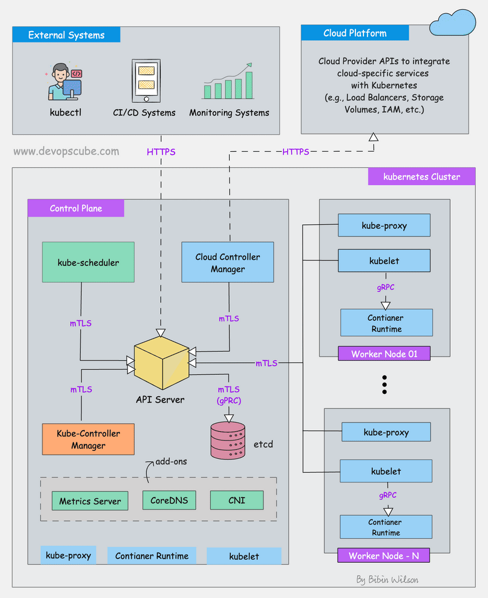
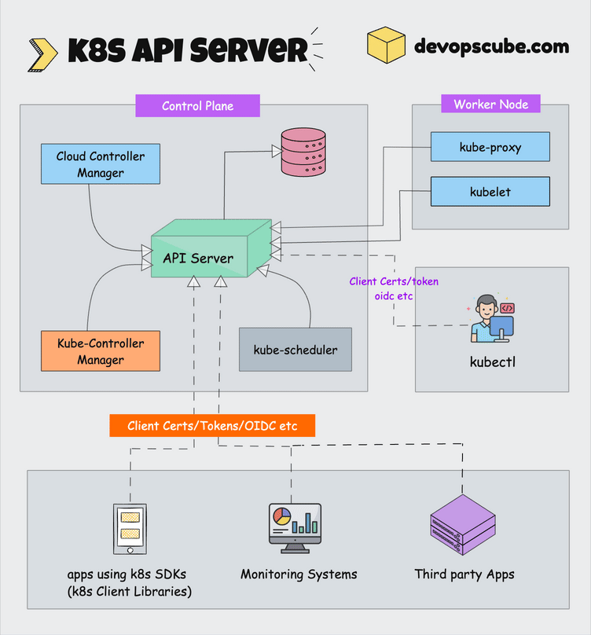
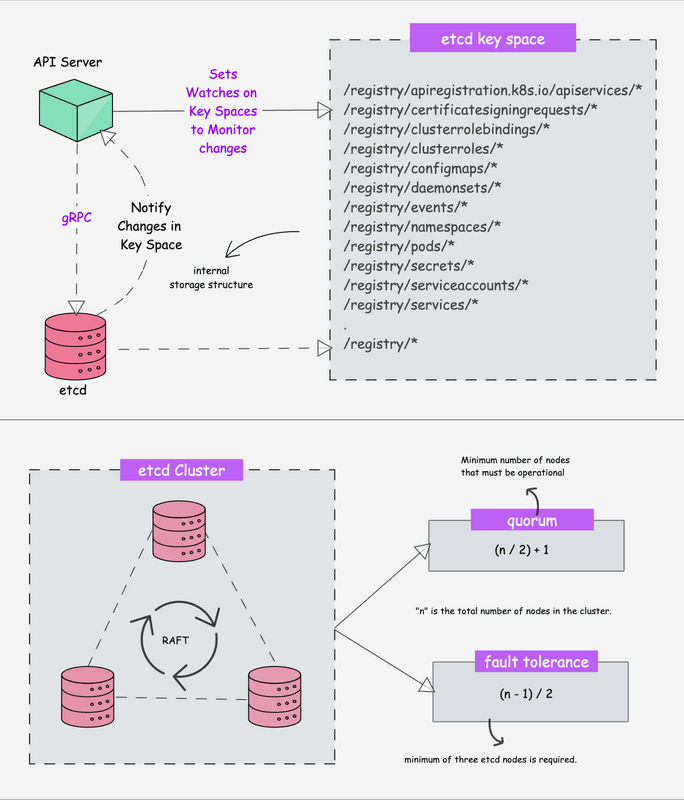

# Logbook
This will be a log of everything I look up/research. I will report any major findings from my work and use this logbook as a notebook for my own notes to assist in my learning. I will consolidate all things here and hope to have a standardized format for note-taking.
> quoated text will be for asides on topics that do not relate to current option or a large divergence in my notes
* **BOLD** will be used for either keywords, emphasis or when there are multiple options and I chose one of the paths


## Project 1 - Understanding Kubernetes Architecture

> Image taken from https://devopscube.com/kubernetes-architecture-explained/

Kubernetes is a distributed system so it has multiple components spread across different servers over a network
* VMs or servers 
* Called a kubernetes cluster 
### Control plane 
Cluster has Control Plane nodes/worker nodes
* Control Plane
    * Has container orchestration/maintaining desired state of the cluster
    * Has:
        * Kube-apiserver
        * etcd
        * kube-scheduler
        * kube-controller-manager
        * cloud-controller-manager
* Worker nodes
    * Runs containerized applications
    * has:
        * kubelet
        * kube-proxy
        * Container runtime

Control plane components:
* kube-apiserver
    * exposes the kubernetes API
    * scalable/handles large number of concurrent requests
    * end users/cluster components talk to the cluster from the API server
    * API management
        * Handles all API requests
    * Authentication/Authorization
    * Processes API requests/validates data for the API objects
    * coordinates all processess between control plan and worker node components
    * Contains aggreagation layer
        * Allows you to extend the API to create custom API resourrces and controllers
    * only component that **kube-apiserver** initiates a connection to is the **etcd** component (all other components connect to the api server)
    * supports watching resources for changes
    * Each component watches the API server to figure out what to do 
* apiserver proxy 
    * used to enable access to ClusterIP services from outside the cluster

    


* etcd
    * acts as both a backend esrvice discovery and a database
    * **brain** of the kube cluster
    * **DISTRIBUTED KEY-VALUE STORE**
        * Strongly consistent
            * if an update is made to a node, consistency will ensure it gets updated to all other nodes in the cluster
            * Achieving 100% availability with strong consistency is impossible
        * Distributed 
        * Key-value store
            * Exposes a key-value API
    * uses raft consensus algorithm [link](https://raft.github.io/?ref=devopscube.com)
    * when using kubectl to get kubernetes object details, you get it from etcd
        * pods are also deployed in etcd
    * etcd stores all configs, states, metadata of kuber objects
    * allows a client to sub to events use `Watch()` API
        * the **api-server** uses etcd's watch to track the change in the state of the object
    * Exposes key-value API 



## Project 18
### Prereqs
* Opened a new folder in WSL for setting up Kubernetes
* Created a new AWS account
* Installed AWS on WSL
* Configured AWS (There are 2 ways to do this)
    * **Using AWS configure command**
        * stroes credentials in a file at `~/.aws/credentials` and output config in `~/.aws/config`
        * This prompts me for:
            * AWS Access key ID
            * AWS Secret access Key
            * Default region name
            * Default output format
        * Easy setup and persistent across shell sessions BUT can get messy with multiple profiles
    * Using CLI environ variables
* IAM users 
    * identity and access management
    * Specific user account within the AWS account
    * Has own credentials (username/pw)
    * Typically the root account is the master account with unrestricted access to everything
    * Good practice is to use the Root account to make IAM users then lock it down
    
Creating an IAM user:
* Search for IAM user in AWS Root user dashboard
* Go to users on left side 
* Create a user and assign them administrator access
    * This gives the user basically everything BUT Root only tasks/deny from other layers 
* User then gets a link with their username that you set for them
* User makes new pw and goes from there
> Note that i had to do MFA on both accounts (root/iam)
> Wonder if there is a way to make mandatory when managing other users 

Setting up git
* Set up repo and connected it to github desktop
* Connected my Ubuntu to git using the CLI
    * Set my environment username and email
    * Set my SSH and HTTPS both up
        * Apparently it is common practice to use both
        * SSH is better for when you want to generate an SSH key once and forget about it. No more token prompts, easy commit signing, and your key never expires
        * HTTPS is hassle-free because port 443 is always open and you can cut a token’s scope to just one repo if you like
        * `origin` is used for SSH
        * `https` is for remote fallback (especially if there is an active network firewall)
        
Message for checking if I'm using SSH = `ssh -T git@github.com`
* Received msg of `Hi Blek1! You've successfully authenticated, but GitHub does not provide shell access.`

Message for checking both = `git remote -v`
```bash
git remote -v  
https   https://github.com/Blek1/ICU_Project.git (fetch)
https   https://github.com/Blek1/ICU_Project.git (push)
origin  git@github.com:Blek1/ICU_Project.git (fetch)
origin  git@github.com:Blek1/ICU_Project.git (push)
```


Back to AWS:
* Set up AWS configure
* Created access key ID/secret access key with IAM account 
* used `aws configure` to set up account 
    * Set region to japan
* used `aws configure list` to see output 

NOTE FROM THE TMUX PART:
```
Open tmux
First, start tmux by opening your terminal and typing tmux, then hit Enter. Create Multiple Panes:

Split your tmux window into multiple panes.
You can split vertically by pressing Ctrl + b, then %, and horizontally by pressing Ctrl + b, then ".

You can create as many panes as you need for parallel execution.

Navigate to Each Pane:
To switch to a different pane, press Ctrl + b, then use the arrow keys to navigate to the pane where you want to execute a command.

Running Commands Simultaneously:
If you want to run the same command in all panes at the same time, you can use the synchronize-panes feature.

To enable this, press Ctrl + b, then type :setw synchronize-panes on and hit Enter. Now, anything you type in one pane will be mirrored in all other panes. To disable this feature, press Ctrl + b, type :setw synchronize-panes off, and hit Enter.

Labs in this tutorial may require running the same commands across multiple compute instances, in those cases consider using tmux and splitting a window into multiple panes with synchronize-panes enabled to speed up the provisioning process.
```
> I had to remove my preferences on `ctrl-b` in my vscode to get this to work


### Installing the client tools
Installing CSSFL
* generates TSL certs
* installed by curling from github repos

Installed kubectl
* CLI to interact with kubernetes API server 

### Compute Resources
